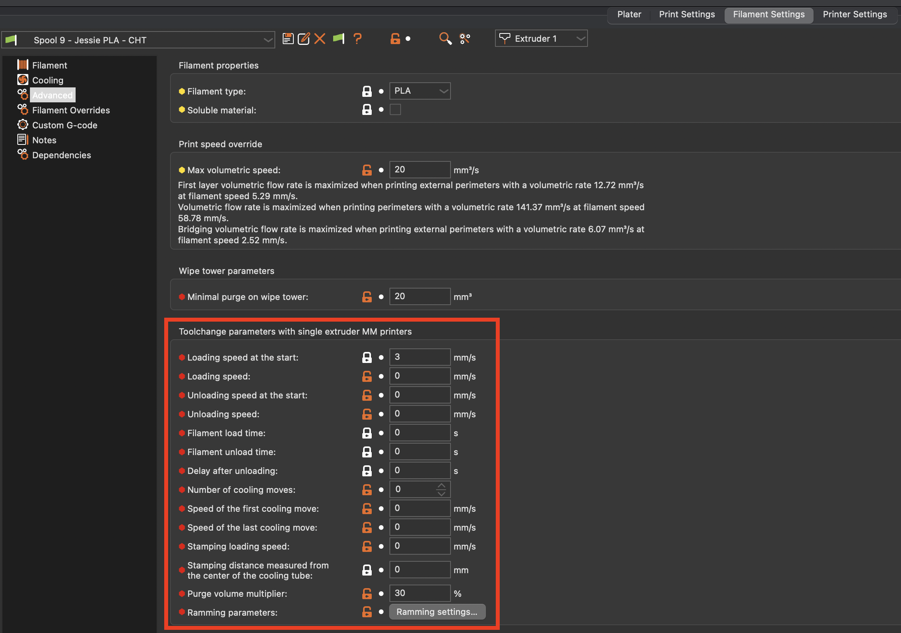
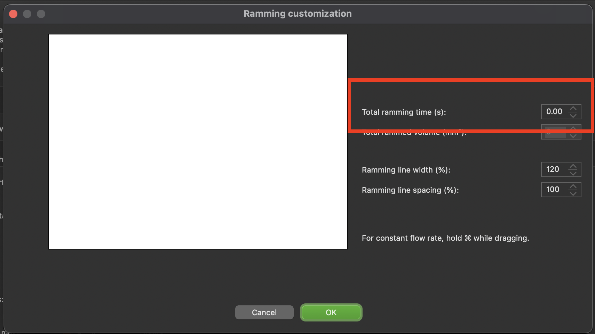

# Slicer Setup

This guide will explain how to setup PrusaSlicer (OrcaSlicer coming soon) with this plugin, optomizing some settings for this plugin.

## PrusaSlicer

1. In PrusaSlicer, go to `Printer Settings` -> `General` -> `Capabilities` -> `Extruders`, and set it to 4
2. Enable the `Single Extruder Multi Material` checkbox


3. In your Klipper `PRINT_START` macro, add the following **BEFORE** your purge line:
```
RESET_CHAMELEON
G4 P1000
PULSE_CHAMELEON PULSES=7
G4 P1000
PULSE_CHAMELEON PULSES={params.INITIAL_EXTRUDER+1}
LOAD_CHAMELEON
SET_CHAMELEON_STATE P={params.INITIAL_EXTRUDER} L=-1
G1 E65 F1000; Change this to your extruder to hotend distance
```
4. Back in PrusaSlicer, in `Custom G-Code` -> `Start G-Code`, pass the parameter `INITIAL_EXTRUDER` to your `PRINT_START` macro:
```
PRINT_START other_parameters... INITIAL_EXTRUDER=[initial_extruder]
```
5. In your Klipper `PRINT_END` macro, add the following **BEFORE** your printer cools down:
```


QUICK_TIP_SHAPING MOVES=3; change this to however any moves works for your filaments
PULSE_CHAMELEON PULSES=6
UNLOAD_CHAMELEON TOOL={p}
```
6. Back in PrusaSlicer, in your `Tool Change G-Code` section, put the following:
```
SET_CHAMELEON_STATE L={layer_num}
{if previous_extruder > -1}
QUICK_TIP_SHAPING MOVES=[filament_loading_speed_start[previous_extruder]]
{endif}
T{next_extruder}
SET_CHAMELEON_STATE P={next_extruder}
```
7. In `Single Extruder MM Setup`, set all the fields **EXCEPT** `Purging Volume` to 0
8. Optionally, enable `High extruder current on filament swap`


9. In `Filament Settings` -> `Advanced` -> `Toolchange Parameters with single extruder MM printers`, set all the values to 0 **EXCEPT** `Purge Volume Multiplier`
10. Open `Ramming settings...` and set `Total ramming time (s)` to 0, then hit `OK`
11. For each of your filament presets, set your `Loading speed at the start` to however many `MOVES` works for your filament with `QUICK_TIP_SHAPING`


